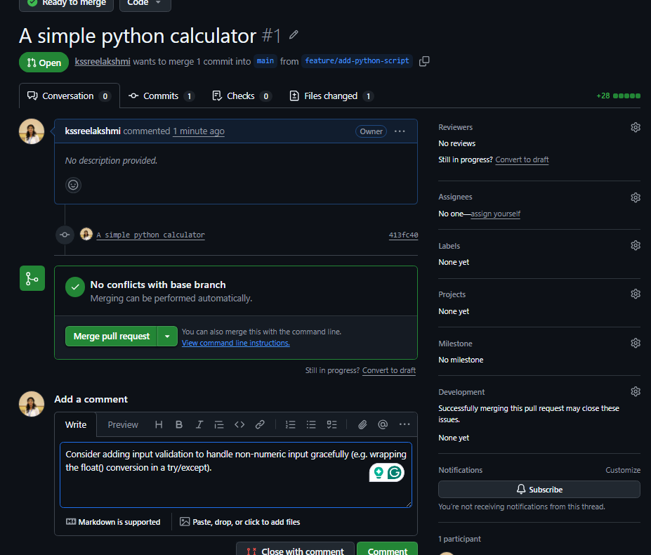
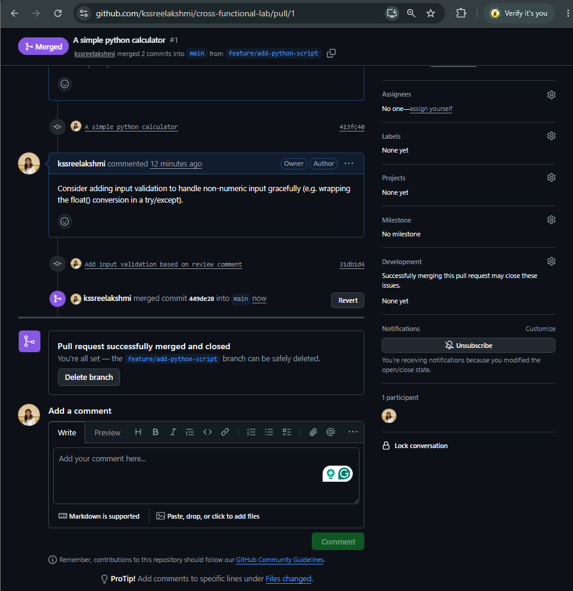
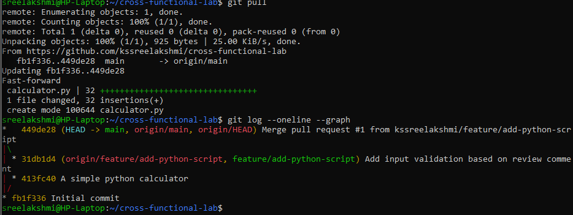

# Cross-Functional Lab

This repo is my hands-on lab for Module 2: Git & GitLab Fundamentals.

## Objective
Practice the core Git workflow: cloning, branching, committing, pushing, creating a merge request, resolving review comments, and merging.

## Operations Performed

1. **Cloned the repository**
   ```
   git clone https://github.com/kssreelakshmi/cross-functional-lab.git
   ```

2. **Created a feature branch**
   ```
   git checkout -b feature/add-python-script
   ```

3. **Modified code**
   Added `calculator.py` — a simple calculator using Python's `match-case` syntax, supporting add, subtract, multiply, and divide operations.

4. **Committed changes**
   ```
   git add calculator.py
   git commit -m "A simple python calculator"
   ```

5. **Pushed the branch**
   ```
   git push -u origin feature/add-python-script
   ```
   Had to set up a GitHub Personal Access Token here, since password auth for git operations is no longer supported.

6. **Created a Pull Request**
   Opened PR #1 "A simple python calculator" from `feature/add-python-script` into `main`.

7. **Resolved review comments**
   Added a review comment suggesting input validation. Updated `calculator.py` to wrap number input in a try/except block, then committed and pushed the fix:
   ```
   git add calculator.py
   git commit -m "Add input validation based on review comment"
   git push
   ```

8. **Merged the branch**
   Merged PR #1 into `main` using a standard merge commit (not squash or rebase), to keep full commit history visible. Deleted the feature branch afterward.

   Final log after merge:
   ```
   git checkout main
   git pull
   git log --oneline --graph
   ```

   Output:
   ```
   *   449de28 (HEAD -> main, origin/main, origin/HEAD) Merge pull request #1 from kssreelakshmi/feature/add-python-script
   |\
   | * 31db1d4 (origin/feature/add-python-script, feature/add-python-script) Add input validation based on review comment
   | * 413fc40 A simple python calculator
   |/
   * fb1f336 Initial commit
   ```

## Deliverables

- Screenshot of Merge Request (PR #1)
- Git log (shown above)
- Repository URL: https://github.com/kssreelakshmi/cross-functional-lab

## Screenshots

### Pull Request Created


### Pull Request Merged


### Final Git Log Graph


## Notes
- Used HTTPS with a Personal Access Token for authentication (no SSH keys set up on this VM yet).
- Chose "Create a merge commit" instead of squash or rebase to preserve the full history of the review-and-fix cycle — this ties directly into my presentation topic, "Merge vs Rebase."
